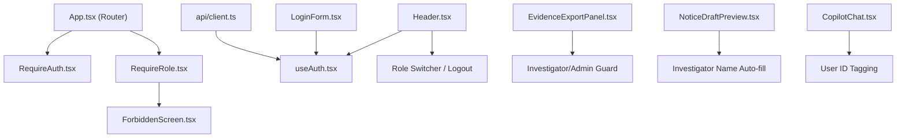

# TRACEX — AUTHENTICATION INTEGRATION IMPACT ANALYSIS
**Integration Coordinator:** Antigravity  
**Authors:** Person 1 (Apoorv) & Person 2 (Anvesh)  
**Status:** **AUTH PROVIDER = NOT YET LOCKED**

---

## 1. Executive Summary

Person 1 and Person 2 are actively evaluating **Firebase Authentication** vs **AWS Cognito** for production identity management.

This document audits the exact current state of authentication in the repository, details what must change for either choice, lists all dependent components, and provides a zero-risk strategy that prevents this architectural decision from blocking hackathon integration phases.

---

## 2. Current State of Authentication in Codebase

### Is authentication already implemented?
- **Backend (`backend/`):** **NO.**  
  There is currently no user database table, no authentication endpoint (`/login`, `/logout`), no password hashing, and no token verification middleware in `backend/`.
- **Frontend (`new-ui/`):** **YES (Complete Security UX Layer).**  
  Person 2 implemented a complete role-based security layer that operates seamlessly via a documented stub (`new-ui/src/api/authStub.ts`). It supports real-time role switching between `INVESTIGATOR`, `ANALYST`, and `ADMIN`, provides route guards, and handles 401/403 API interceptors.

### What authentication mechanism currently exists?
- **Current Mechanism:** In-memory, contract-compliant simulated session provider in `new-ui/src/api/authStub.ts`.
- **Pre-seeded Accounts:**
  1. `investigator` / `password` → Role: `INVESTIGATOR` (Full access to case workspace, tracing, intelligence, evidence export, notice preview)
  2. `analyst` / `password` → Role: `ANALYST` (Read-only forensic analysis, graph exploration, copilot queries; evidence export blocked)
  3. `admin` / `password` → Role: `ADMIN` (Full administrative privileges, user management, audit inspection)
- **Integration Toggle:** `new-ui/src/api/client.ts` contains `USE_AUTH_STUB = true`. Flipping this to `false` automatically redirects requests to `/api/v1/auth/login`.

---

## 3. Impact Analysis: Firebase vs. AWS Cognito

| Evaluation Dimension | Option A: Firebase Auth | Option B: AWS Cognito |
| :--- | :--- | :--- |
| **Setup Overhead** | Extremely fast (Google Cloud Console / Firebase CLI, ~15 mins) | Moderate (AWS IAM, User Pool, App Client, Domain config, ~45 mins) |
| **Backend Verification** | `firebase-admin` Python SDK validates JWT and extracts custom claims in 5 lines | `python-jose` or `boto3` decodes JWKS from Cognito User Pool endpoint |
| **Role Management** | Firebase Custom Claims (`admin.auth().setCustomUserClaims(uid, { role: 'investigator' })`) | Cognito Groups (`investigator`, `analyst`, `admin`) mapped via `cognito:groups` token claim |
| **Frontend SDK** | `npm install firebase` (~500 KB bundle) | `npm install @aws-amplify/auth` (~1.2 MB bundle) or raw REST/JWT |
| **Offline Resilience** | Built-in offline token caching | Token caching in browser storage |

---

## 4. Required Changes per Provider

### If Option A (Firebase Auth) is Selected:

#### Backend Changes (`backend/`):
1. Add `firebase-admin>=6.4.0` to `backend/requirements.txt`.
2. Add `backend/core/auth_firebase.py`:
   ```python
   import firebase_admin
   from firebase_admin import auth, credentials
   from fastapi import Depends, HTTPException, Security
   from fastapi.security import HTTPBearer, HTTPAuthorizationCredentials

   cred = credentials.Certificate(os.getenv("FIREBASE_SERVICE_ACCOUNT_KEY_PATH"))
   firebase_admin.initialize_app(cred)
   security = HTTPBearer()

   def get_current_user(res: HTTPAuthorizationCredentials = Security(security)):
       token = res.credentials
       try:
           decoded_token = auth.verify_id_token(token)
           return decoded_token
       except Exception:
           raise HTTPException(status_code=401, detail="Invalid Firebase Token")
   ```
3. Add dependency `require_role(["investigator", "admin"])` on sensitive routes.

#### Frontend Changes (`new-ui/`):
1. Add `firebase` to `new-ui/package.json`.
2. Create `new-ui/src/api/firebase.ts` with project config.
3. In `new-ui/src/hooks/useAuth.tsx`:
   - Replace `authStub.login(username, password)` with `signInWithEmailAndPassword(auth, email, password)`.
   - Extract `token.claims.role` to set `user.role`.
4. In `new-ui/src/api/client.ts`:
   - Attach `Authorization: Bearer <firebaseIdToken>` on Axios requests.
   - Set `USE_AUTH_STUB = false`.

---

### If Option B (AWS Cognito) is Selected:

#### Backend Changes (`backend/`):
1. Add `python-jose[cryptography]>=3.3.0` and `requests` to `backend/requirements.txt`.
2. Add `backend/core/auth_cognito.py`:
   - Fetch public keys from `https://cognito-idp.{region}.amazonaws.com/{userPoolId}/.well-known/jwks.json`.
   - Decode JWT and verify signature, issuer, and token expiration.
   - Extract `cognito:groups` array to determine role.
3. Add role-check decorator to FastAPI routes.

#### Frontend Changes (`new-ui/`):
1. Add `@aws-amplify/auth` to `new-ui/package.json`.
2. Configure Amplify with User Pool ID and Client ID in `new-ui/src/main.tsx`.
3. In `new-ui/src/hooks/useAuth.tsx`:
   - Replace login with `signIn({ username, password })`.
   - Map Cognito groups to `INVESTIGATOR | ANALYST | ADMIN`.
4. In `new-ui/src/api/client.ts`:
   - Attach Cognito JWT token to Axios interceptor.
   - Set `USE_AUTH_STUB = false`.

---

## 5. Existing Components Dependent on Authentication

The following components already contain the necessary hooks and contracts:



---

## 6. Recommended Hackathon Integration Strategy

**DECISION:** Leave `AUTH PROVIDER = NOT YET LOCKED` during Phases 1–4.

1. **Phases 1–4 (Core Forensics Integration):**  
   Continue using Person 2's verified `authStub.ts` (`USE_AUTH_STUB = true`). This allows the team to merge real blockchain tracing, FIFO taint attribution, R1–R8 intelligence findings, and copilot without getting blocked by external cloud provider setup, API keys, or email verification flows.
2. **Phase 5 (Security & Auth Provider Binding):**  
   Once the team finalizes Firebase vs AWS Cognito, bind the chosen provider into `backend/` and toggle `USE_AUTH_STUB = false` in `new-ui/`.
3. **Demo Safeguard:**  
   If network access is restricted or cloud authentication credentials fail during the live hackathon presentation, `USE_AUTH_STUB` serves as an instant zero-downtime offline fallback.
