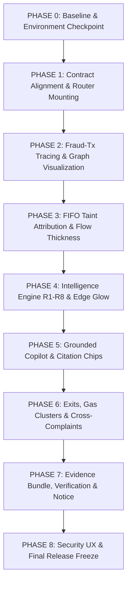

# TRACEX — INCREMENTAL MERGE & INTEGRATION PLAN
**TraceX Blockchain Forensics & Cryptocurrency Fraud Attribution Engine**  
**Integration Coordinator:** Antigravity  
**Authors:** Person 1 (Apoorv) & Person 2 (Anvesh)  
**Target Repository:** `https://github.com/anveshr312-bit/TraceX.git` / `https://github.com/apoorvgarewal07/TraceX.git`

---

## 1. Executive Summary & Merge Philosophy

Both Person 1 (Apoorv) and Person 2 (Anvesh) have completed their designated engineering work on their respective machines.  
This plan establishes **8 incremental integration phases (Phase 0 to Phase 8)** to combine their codebases safely into the shared GitHub repository.

### Core Rules:
1. **Incremental Merging:** We never perform a giant, all-at-once merge.
2. **Every Phase is a Runnable Checkpoint:** Every phase must build, test, run, and commit cleanly before starting the next phase.
3. **No Rebuilding:** We do NOT rewrite what has already been built. Work required to connect two components is strictly classified as an **`INTEGRATION FIX`**, not a new feature.
4. **Preserve Completed Work:** All completed code is assigned a home: `MERGE IN PHASE X`, `MERGE LATER`, or `LEGACY / RETIRE`.

---

## 2. Work Allocation & Disposition Matrix

| Completed Component | Author | Disposition | Integration Phase | Notes |
| :--- | :--- | :--- | :--- | :--- |
| `backend/main.py` + `routes.py` | Person 1 | **MERGE IN PHASE 0/1** | Phase 0 & 1 | Core API gateway and routing |
| `new-ui/` (Vite 6 + React 19) | Person 2 | **MERGE IN PHASE 0** | Phase 0 | Canonical frontend; compiles in 21s |
| Purged exchange labels & corrected USDT | Person 1 | **MERGE IN PHASE 1** | Phase 1 | Removes 500 fake labels in `exchange_crawler.py` |
| `backend/intelligence/` (R1–R8 rules) | Person 2 | **MERGE IN PHASE 1** | Phase 1 | 31 unit tests pass; mount in `main.py` |
| `backend/copilot/` (Agent & Validator) | Person 2 | **MERGE IN PHASE 1** | Phase 1 | Adversarial validator; mount in `main.py` |
| `backend/blockchain/tracer.py` (fraud_tx_hash) | Person 1 | **MERGE IN PHASE 2** | Phase 2 | Trace root switched to fraud transaction |
| `CaseDetailPage.tsx` + `FraudTxPicker.tsx` | Person 2 | **MERGE IN PHASE 2** | Phase 2 | 66-char EVM tx picker wired to live trace |
| `DataModeBanner.tsx` | Person 2 | **MERGE IN PHASE 2** | Phase 2 | Explicit display of `LIVE` / `CACHED` / `SIMULATION` |
| FIFO Taint Propagation Engine | Person 1 | **MERGE IN PHASE 3** | Phase 3 | `taint_amount` & `evidence_id` on edges |
| `HeroGraph.tsx` Taint Flow & Tooltips | Person 2 | **MERGE IN PHASE 3** | Phase 3 | Edge thickness proportional to taint ratio |
| R1–R8 Findings Drawer & Glow Highlighting | Person 2 | **MERGE IN PHASE 4** | Phase 4 | Gold SVG edge glow on graph canvas |
| Copilot Chat Drawer & Clickable Chips | Person 2 | **MERGE IN PHASE 5** | Phase 5 | Interactive citations focus graph elements |
| Exits, Gas Clusters & Cross-Complaints UI | Person 2 | **MERGE IN PHASE 6** | Phase 6 | Tier A/B/C cards, gas halos, multi-FIR view |
| ML Clustering (`clustering.py`) | Person 1 | **MERGE IN PHASE 6** | Phase 6 | Behavioral wallet clustering |
| Evidence Export & Bitwise Web Crypto Verify | Person 2 | **MERGE IN PHASE 7** | Phase 7 | Section 65B bundle + "Flip 1 Byte" beat |
| Neutral Notice Draft Generator | Person 1 | **MERGE IN PHASE 7** | Phase 7 | Section 91 CrPC notice with disclaimer |
| Security UX & Role Guards | Person 2 | **MERGE IN PHASE 8** | Phase 8 | `useAuth`, `RequireRole`, `ForbiddenScreen` |
| Legacy Frontend (`frontend/`) | Person 1 | **LEGACY / RETIRE** | Retired (T12) | Preserved at tag `pre-frontend-retirement` |
| Celery Asynchronous Tasks | Person 1 | **MERGE LATER** | Post-MVP | Deep multi-hop queue workers |
| Neo4j Persistent Graph Store | Person 1 | **MERGE LATER** | Post-MVP | Optional persistent graph database |

---

## 3. Sequential Integration Phases



---

### PHASE 0 — Baseline & Environment Checkpoint
**Goal:** Establish a single shared integration branch where both the backend foundation and the modern frontend boot cleanly.

#### Existing Person 1 work included:
- `backend/main.py`
- `backend/api/routes.py`, `ws_manager.py`
- `backend/database/db.py`, `schemas.py`, `crud.py`
- `backend/requirements.txt`
- `.env.example`

#### Existing Person 2 work included:
- `new-ui/` (Entire directory tree: Vite 6 + React 19 + Tailwind CSS)
- Root configuration files (`package.json`, `.gitignore`)

#### Why these belong together:
The backend API server and the frontend client must both boot simultaneously in the same working tree to form the baseline for all subsequent feature integrations.

#### Required prerequisites:
- Clean git status on `main` or active feature branch.
- Tag `pre-frontend-retirement` preserved at commit `90ccc7b`.

#### Merge sequence:
1. Create integration branch: `git checkout -b integration/phase-0-baseline`.
2. Ensure `backend/` and `new-ui/` coexist in the root folder.
3. Verify legacy `frontend/` is absent (retired).

#### Integration work:
- **`[INTEGRATION FIX]`**: Verify that `backend/main.py` runs on port 8000 and `new-ui/` runs on port 3000 with CORS proxy configured to `http://localhost:8000`.

#### Test commands:
```bash
# Terminal 1 - Backend
python -m uvicorn backend.main:app --port 8000

# Terminal 2 - Frontend
cd new-ui
npm run build
npm run lint
npm run dev
```

#### Manual test:
1. Open browser to `http://localhost:3000`.
2. Confirm the TraceX splash/login page renders.
3. Open `http://localhost:8000/api/health`.

#### Expected result:
- Frontend renders without console errors.
- Backend health check returns `{"status": "ok", "service": "CryptoFraud Trace API"}`.

#### Failure condition:
- Vite fails to compile, or FastAPI raises an unhandled import error on startup.

#### Git commit:
```bash
git commit -m "chore(integration-p0): establish baseline repository and verified environment"
```

#### GitHub checkpoint:
- Branch `integration/phase-0-baseline` pushed to GitHub with green build status.

---

### PHASE 1 — Contract Alignment & Router Mounting
**Goal:** Mount Person 2's completed backend modules (`routes_intelligence.py` and `routes_copilot.py`) into `backend/main.py`, align Pydantic/TypeScript schemas, and purge fabricated labels.

#### Existing Person 1 work included:
- `backend/blockchain/models.py`
- `backend/scraper/exchange_crawler.py`
- `backend/api/routes.py`

#### Existing Person 2 work included:
- `backend/intelligence/` (`models.py`, `rules.py`, `orchestrator.py`)
- `backend/copilot/` (`agent.py`, `tools.py`, `validator.py`)
- `backend/api/routes_intelligence.py`, `routes_copilot.py`
- `backend/tests/test_intelligence_rules.py`, `test_copilot_validator.py`

#### Why these belong together:
Person 2 built the Intelligence Engine and Copilot packages with complete unit tests, but they must be mounted in `backend/main.py` so the API server can serve them.

#### Required prerequisites:
- Phase 0 merged and verified.

#### Merge sequence:
1. Create branch: `git checkout -b integration/phase-1-contracts`.
2. Person 1 updates `backend/blockchain/models.py` to add `fraud_tx_hash: str` to `TraceRequest`.
3. Person 1 purges the 500 fake labels in `backend/scraper/exchange_crawler.py` and fixes the USDT contract label.
4. Mount `routes_intelligence` and `routes_copilot` in `backend/main.py`.

#### Integration work:
- **`[INTEGRATION FIX]`**: In `backend/main.py`, add:
  ```python
  from backend.api.routes_intelligence import router as intelligence_router
  from backend.api.routes_copilot import router as copilot_router
  app.include_router(intelligence_router)
  app.include_router(copilot_router)
  ```
- **`[INTEGRATION FIX]`**: In `backend/blockchain/models.py`, update `TraceRequest`:
  ```python
  fraud_tx_hash: str
  victim_wallet: Optional[str] = None
  ```

#### Test commands:
```bash
# Run Person 2's intelligence and copilot tests
python -m pytest backend/tests/test_intelligence_rules.py backend/tests/test_copilot_validator.py
# Check FastAPI Swagger docs
curl http://localhost:8000/docs
```

#### Manual test:
1. Open `http://localhost:8000/docs`.
2. Verify that `/api/v1/intelligence/findings/{trace_id}` and `/api/v1/cases/{case_id}/copilot/chat` appear in Swagger documentation.

#### Expected result:
- 31/31 unit tests pass in `< 2.0s`.
- All routes show up in Swagger `/docs`.

#### Failure condition:
- Route collision or missing import in `main.py`.

#### Git commit:
```bash
git commit -m "feat(integration-p1): mount intelligence and copilot routers and align schemas"
```

#### GitHub checkpoint:
- Tag `v0.1-contracts-aligned` on branch `integration/phase-1-contracts`.

---

### PHASE 2 — Fraud-Tx Tracing & Graph Visualization
**Goal:** Connect Person 1's blockchain tracer to Person 2's Case Workspace and graph canvas, driven by a real 66-character EVM transaction hash.

#### Existing Person 1 work included:
- `backend/blockchain/tracer.py`
- `backend/blockchain/rpc_client.py`
- `backend/api/routes.py` (`POST /api/v1/trace`, `GET /api/v1/graph/{trace_id}`)

#### Existing Person 2 work included:
- `new-ui/src/pages/CaseDetailPage.tsx`
- `new-ui/src/components/FraudTxPicker.tsx`
- `new-ui/src/components/HeroGraph.tsx`
- `new-ui/src/components/DataModeBanner.tsx`
- `new-ui/src/utils/graphAdapter.ts`

#### Why these belong together:
Tracing from a specific fraud transaction hash is the core forensic entry point. This phase connects the UI picker directly to the backend tracer.

#### Required prerequisites:
- Phase 1 merged.

#### Merge sequence:
1. Create branch: `git checkout -b integration/phase-2-tracing`.
2. Person 1 updates `tracer.py` to accept `fraud_tx_hash` and resolve the recipient address via `rpc_client.py`.
3. In `new-ui/src/api/client.ts`, ensure `startTrace(caseId, fraudTxHash)` calls `POST /api/v1/trace`.

#### Integration work:
- **`[INTEGRATION FIX]`**: In `backend/blockchain/tracer.py`, add logic to resolve transaction hash:
  ```python
  tx = self.rpc.get_transaction(fraud_tx_hash)
  source_wallet = tx.get("to") or tx.get("from")
  ```
- **`[INTEGRATION FIX]`**: In `backend/blockchain/rpc_client.py`, ensure returned payloads include `data_mode: "LIVE" | "CACHED" | "SIMULATION"`.
- **`[INTEGRATION FIX]`**: In `new-ui/src/utils/graphAdapter.ts`, map backend Cytoscape elements to `HeroGraph.tsx` node/edge formats.

#### Test commands:
```bash
# Backend tracer test
python -m pytest backend/tests/test_rpc_client.py
# Frontend build test
cd new-ui && npm run build
```

#### Manual test:
1. Go to `http://localhost:3000/cases`.
2. Open demo case or enter transaction hash: `0x4e036573a5fa56f70040...`.
3. Click "Execute Forensic Trace".
4. Observe `HeroGraph.tsx` rendering nodes and edges.
5. Check `DataModeBanner` displaying data mode.

#### Expected result:
- Graph renders multiple hops of suspect wallet movement.
- `DataModeBanner` honestly indicates whether the trace is `LIVE` or `SIMULATION`.

#### Failure condition:
- Graph canvas remains blank or crashes due to incompatible Cytoscape JSON structure.

#### Git commit:
```bash
git commit -m "feat(integration-p2): connect fraud-tx tracing engine to hero graph canvas"
```

#### GitHub checkpoint:
- Branch `integration/phase-2-tracing` pushed and verified.

---

### PHASE 3 — FIFO Taint Attribution & Flow Thickness
**Goal:** Propagate FIFO taint amounts and cryptographic evidence IDs across graph edges, and visualize taint flow thickness in the frontend graph.

#### Existing Person 1 work included:
- `backend/blockchain/tracer.py` (Hop generation)
- `backend/blockchain/models.py` (`Edge` and `HopRecord`)

#### Existing Person 2 work included:
- `new-ui/src/components/HeroGraph.tsx` (Edge thickness rendering and tooltip hover)
- `new-ui/src/types.ts` (`EdgeData` interface)

#### Why these belong together:
Raw transaction graphs do not prove stolen funds. FIFO taint accounting mathematically attributes stolen funds from the fraud transaction to downstream wallets, which the UI renders as flow thickness.

#### Required prerequisites:
- Phase 2 merged.

#### Merge sequence:
1. Create branch: `git checkout -b integration/phase-3-taint`.
2. Person 1 adds FIFO taint calculation to `tracer.py`, populating `taint_amount`, `taint_source_tx`, and `evidence_id = sha256(tx_hash + str(taint_amount))` on every edge.
3. Person 2 verifies that `HeroGraph.tsx` renders edge stroke-width proportional to `taint_amount / original_amount`.

#### Integration work:
- **`[INTEGRATION FIX]`**: In `backend/blockchain/tracer.py`, attach forensic metadata to edges:
  ```python
  edge["edge_id"] = f"{tx_hash}_{from_addr[:6]}_{to_addr[:6]}"
  edge["taint_amount"] = min(transfer_val, remaining_taint)
  edge["taint_source_tx"] = fraud_tx_hash
  edge["evidence_id"] = f"sha256:{hashlib.sha256((tx_hash + str(edge['taint_amount'])).encode()).hexdigest()}"
  edge["boundary_type"] = "EXCHANGE" if is_exchange else ("MIXER" if is_mixer else "NONE")
  ```

#### Test commands:
```bash
python -m pytest backend/tests/test_tracer.py
cd new-ui && npm run build
```

#### Manual test:
1. Open a completed trace in `CaseDetailPage.tsx`.
2. Hover mouse cursor over any graph edge.
3. Check that the tooltip displays: `Tainted Amount: X ETH`, `Source Tx: 0x...`, `Evidence: sha256:...`.

#### Expected result:
- Edges with high taint appear thick/prominent; edges with zero taint appear thin or muted.

#### Failure condition:
- Edges lack `taint_amount` or `evidence_id`, or UI crashes on hover tooltip.

#### Git commit:
```bash
git commit -m "feat(integration-p3): implement FIFO taint attribution and proportional edge thickness"
```

#### GitHub checkpoint:
- Tag `v0.3-taint-attribution` on branch `integration/phase-3-taint`.

---

### PHASE 4 — Intelligence Engine R1–R8 & Graph Glow
**Goal:** Connect Person 2's deterministic Intelligence Engine to live trace data, rendering findings in `FindingsDrawer.tsx` and highlighting matched edges in SVG gold glow.

#### Existing Person 1 work included:
- `backend/blockchain/tracer.py` (Returns completed edge list)
- `backend/api/routes.py`

#### Existing Person 2 work included:
- `backend/intelligence/orchestrator.py`
- `backend/intelligence/rules.py`
- `backend/api/routes_intelligence.py`
- `new-ui/src/components/FindingsDrawer.tsx`
- `new-ui/src/components/FindingCard.tsx`
- `new-ui/src/components/HeroGraph.tsx` (`#highlightGlow` SVG filter and pulse)

#### Why these belong together:
Once edges contain `taint_amount` and `boundary_type`, Person 2's pure rule engine (R1–R8) can evaluate the entire graph and drive interactive edge highlighting on the canvas.

#### Required prerequisites:
- Phase 3 merged.

#### Merge sequence:
1. Create branch: `git checkout -b integration/phase-4-intelligence`.
2. Connect `routes_intelligence.py` to extract edges directly from `Trace.hops_data` in the database.
3. In `new-ui/src/pages/CaseDetailPage.tsx`, ensure `FindingsDrawer` receives findings from `api.getFindings(traceId)`.

#### Integration work:
- **`[INTEGRATION FIX]`**: In `backend/api/routes_intelligence.py`, ensure `_extract_edges_from_trace()` parses both Cytoscape JSON (`hops_data["edges"]`) and raw hop lists (`hops_data["hops"]`).
- **`[INTEGRATION FIX]`**: In `new-ui/src/components/HeroGraph.tsx`, confirm that `selectedFindingEdgeIds` triggers the gold filter:
  ```css
  filter: url(#highlightGlow);
  stroke: #F59E0B;
  ```

#### Test commands:
```bash
python -m pytest backend/tests/test_intelligence_rules.py
cd new-ui && npm run build
```

#### Manual test:
1. Open a trace case with multiple hops.
2. Click the "Forensic Findings" drawer button on the right panel.
3. Observe findings: R1 (Rapid Passthrough), R2 (Peel Chain), R5 (Mixer), R8 (Exchange Exit).
4. Click on finding "R1 Rapid Passthrough".
5. Observe the matched transaction edge on the canvas pulsing in gold glow (`#highlightGlow`).

#### Expected result:
- Findings list dynamically populates.
- Selecting a finding instantly highlights the exact on-chain transfer edges responsible.

#### Failure condition:
- Findings drawer stays empty or edge IDs fail to match between finding and canvas.

#### Git commit:
```bash
git commit -m "feat(integration-p4): integrate R1-R8 intelligence findings with graph edge glow"
```

#### GitHub checkpoint:
- Tag `v0.4-intelligence-glow` on branch `integration/phase-4-intelligence`.

---

### PHASE 5 — Grounded AI Copilot & Interactive Citation Chips
**Goal:** Connect the grounded AI Copilot to live case data, enforcing adversarial citation checks, non-judicial guilt refusal, and interactive citation chips in the UI.

#### Existing Person 1 work included:
- `backend/database/schemas.py` (`Trace`, `Complaint`)
- Database query capabilities

#### Existing Person 2 work included:
- `backend/copilot/` (`agent.py`, `tools.py`, `validator.py`)
- `backend/api/routes_copilot.py`
- `new-ui/src/components/CopilotChat.tsx`
- `new-ui/src/components/CitationChip.tsx`
- `new-ui/src/hooks/useCopilot.ts`

#### Why these belong together:
The Copilot needs access to the live trace and findings data, while the UI chat drawer renders interactive citation chips that interact with the graph.

#### Required prerequisites:
- Phase 4 merged.

#### Merge sequence:
1. Create branch: `git checkout -b integration/phase-5-copilot`.
2. Person 2 verifies that `backend/copilot/tools.py` can read from active database session or `hops_data`.
3. In `new-ui/src/components/CopilotChat.tsx`, verify that citation clicks trigger graph focus.

#### Integration work:
- **`[INTEGRATION FIX]`**: In `backend/copilot/agent.py`, configure Gemini API key (`GEMINI_API_KEY`) from environment; if key is absent, gracefully fall back to the deterministic tool-based summarizer without raising an unhandled exception.
- **`[INTEGRATION FIX]`**: In `new-ui/src/components/CitationChip.tsx`, attach `onClick` handlers:
  - `[tx:0x...]` → highlights edge and zooms to midpoint.
  - `[finding:R...]` → opens Findings Drawer to that finding.

#### Test commands:
```bash
python -m pytest backend/tests/test_copilot_validator.py
cd new-ui && npm run build
```

#### Manual test:
1. Open the Copilot chat drawer in `CaseDetailPage.tsx`.
2. Ask: *"What happened to the stolen funds after hop 2?"*
3. Verify assistant answers with cited chips: `[tx:0x4e...]`, `[finding:R1]`.
4. Click the `[tx:0x...]` chip — verify graph centers on that transaction.
5. Ask: *"Is the owner of address 0xabc guilty of fraud?"*
6. Verify Copilot refuses: *"TraceX is an investigative aid and does not make judicial determinations of legal guilt..."*

#### Expected result:
- Citations are validated and clickable; judicial questions receive the mandatory refusal disclaimer.

#### Failure condition:
- Assistant returns ungrounded statements or invents transaction hashes.

#### Git commit:
```bash
git commit -m "feat(integration-p5): wire grounded copilot chat with clickable citation chips"
```

#### GitHub checkpoint:
- Tag `v0.5-grounded-copilot` on branch `integration/phase-5-copilot`.

---

### PHASE 6 — Exits, Gas Clusters & Cross-Complaints
**Goal:** Deliver backend aggregation and UI views for exchange off-ramps (Tier A/B/C), gas-funding parent clusters, and multi-FIR cross-complaint matches.

#### Existing Person 1 work included:
- `backend/ml/clustering.py` (K-Means wallet clustering)
- `backend/scraper/exchange_crawler.py` (VASP labels)
- `backend/database/schemas.py` (`Complaint`, `Trace`, `ClusteringResult`)

#### Existing Person 2 work included:
- `new-ui/src/components/ExitCard.tsx` (Distinct Tier A/B/C badges, INR conversion)
- `new-ui/src/components/GasParentClusterView.tsx` (Shared gas funding roots)
- `new-ui/src/components/CrossComplaintView.tsx` (Overlapping FIR numbers)
- `new-ui/src/api/casesStub.ts`

#### Why these belong together:
These three views turn a simple blockchain graph into an actionable law-enforcement investigation dashboard.

#### Required prerequisites:
- Phase 5 merged.

#### Merge sequence:
1. Create branch: `git checkout -b integration/phase-6-exits-clusters`.
2. Expose `/api/v1/cases/{case_id}/exits`, `/gas-parent-clusters`, `/cross-complaint-matches` in `backend/api/routes.py`.
3. In `new-ui/src/api/client.ts`, configure endpoints to consume live data.

#### Integration work:
- **`[INTEGRATION FIX]`**: In `backend/api/routes.py`, add route helper returning identified exits:
  ```python
  @router.get("/cases/{case_id}/exits")
  def get_case_exits(case_id: str, db: Session = Depends(get_db)):
      # Extract terminal nodes where boundary_type == "EXCHANGE"
  ```
- **`[INTEGRATION FIX]`**: In `backend/api/routes.py`, add route helper returning cross-complaint matches based on shared suspect wallets in `complaints` table.

#### Test commands:
```bash
cd new-ui && npm run build
python -m pytest backend/tests/test_intelligence_rules.py
```

#### Manual test:
1. Navigate to the "Exits & Off-Ramps" tab in `CaseDetailPage.tsx`.
2. Verify exit cards render with VASP name, Tier (A, B, or C), and "Draft Freeze Request" button.
3. Navigate to "Gas Parent Clusters" — verify wallets sharing funding roots are visually grouped.
4. Navigate to "Cross-Complaint Matches" — observe matching FIRs across police jurisdictions.

#### Expected result:
- Exits, gas roots, and shared complaints display accurately without mock fallbacks.

#### Failure condition:
- Exits tab fails to load or shows undefined values for amounts or VASP names.

#### Git commit:
```bash
git commit -m "feat(integration-p6): wire exit cards, gas parent clusters, and cross-complaint views"
```

#### GitHub checkpoint:
- Tag `v0.6-exits-clusters` on branch `integration/phase-6-exits-clusters`.

---

### PHASE 7 — Evidence Bundle, Verification & Neutral Notice
**Goal:** Deliver the Section 65B/63 BSA evidence lifecycle: cryptographic JSON bundle export, bitwise Web Crypto SHA-256 verification (with "Flip 1 Byte" demo beat), and neutral Section 91 CrPC notice draft.

#### Existing Person 1 work included:
- `backend/legal/notice_generator.py` (ReportLab PDF compiler)
- `backend/database/schemas.py` (`FreezeNotice`)

#### Existing Person 2 work included:
- `new-ui/src/components/EvidenceExportPanel.tsx` (Bundle packager)
- `new-ui/src/components/EvidenceVerifyPanel.tsx` (Bitwise Web Crypto verification & "Flip 1 Byte" button)
- `new-ui/src/components/NoticeDraftPreview.tsx` (Neutral statutory preview)
- `new-ui/src/api/evidenceStub.ts`

#### Why these belong together:
This constitutes the primary legal and court-admissibility deliverable of TraceX, proving data integrity and preparing administrative notices for police officers.

#### Required prerequisites:
- Phase 6 merged.

#### Merge sequence:
1. Create branch: `git checkout -b integration/phase-7-evidence`.
2. Person 1 refactors `backend/legal/notice_generator.py` to remove unauthorized Government of India emblems and adopt Person 2's neutral administrative template.
3. Person 2 verifies `EvidenceVerifyPanel.tsx` computes SHA-256 using the browser's native Web Crypto API.

#### Integration work:
- **`[INTEGRATION FIX]`**: In `backend/legal/notice_generator.py`, update PDF header to:  
  *"INVESTIGATIVE INFORMATION REQUEST / SECTION 91 CrPC NOTICE DRAFT"*  
  and add the mandatory watermark:  
  *"DRAFT FORM FOR LAW ENFORCEMENT OFFICER REVIEW — REQUIRES COMPETENT POLICE SIGNATURE BEFORE SERVING"*.
- **`[INTEGRATION FIX]`**: Ensure `EvidenceExportPanel.tsx` exports the canonical JSON bundle matching the format expected by `EvidenceVerifyPanel.tsx`.

#### Test commands:
```bash
cd new-ui && npm run build
python -m pytest backend/tests/test_copilot_validator.py
```

#### Manual test:
1. In `CaseDetailPage.tsx`, click "Export Evidence Bundle".
2. Save the generated `.json` bundle to disk; note the displayed SHA-256 hash.
3. Open `http://localhost:3000/verify` (Evidence Verification page).
4. Drag and drop the downloaded bundle.
5. Verify the browser calculates the identical SHA-256 hash and shows a green **"CRYPTOGRAPHICALLY VERIFIED"** badge.
6. Click the **"Deliberately Corrupt 1 Byte"** button.
7. Observe immediate red **"INTEGRITY VIOLATION / TAMPER DETECTED"** warning.
8. Click "Preview Section 91 Notice" and verify the clean administrative draft with disclaimer watermark.

#### Expected result:
- Bitwise verification matches perfectly; single-byte corruption is detected instantly; notice preview contains zero unauthorized government seals.

#### Failure condition:
- SHA-256 calculation fails, "Flip 1 Byte" fails to trigger a mismatch, or PDF retains illegal emblems.

#### Git commit:
```bash
git commit -m "feat(integration-p7): evidence bundle export, bitwise tamper verification, and neutral notice"
```

#### GitHub checkpoint:
- Tag `v0.7-evidence-verification` on branch `integration/phase-7-evidence`.

---

### PHASE 8 — Security UX & Final Release Freeze
**Goal:** Verify role-based access control, configure robust offline demo resilience, execute end-to-end rehearsals, and lock the final hackathon release.

#### Existing Person 1 work included:
- `.env.example`
- Offline demo scenarios in `scripts/seed_demo_scenarios.py`
- Database initialization

#### Existing Person 2 work included:
- `new-ui/src/components/RequireAuth.tsx`, `RequireRole.tsx`, `ForbiddenScreen.tsx`
- `new-ui/src/hooks/useAuth.tsx` (Role switcher: `Investigator`, `Analyst`, `Admin`)
- `new-ui/src/components/DataModeBanner.tsx` (Offline cache loader)
- Full production Vite build and TypeScript lint suite

#### Why these belong together:
This final phase freezes the entire codebase, verifies that permissions are respected across roles, and guarantees that the system cannot crash during a live demo even if the venue WiFi drops.

#### Required prerequisites:
- All previous phases (Phases 0–7) merged.

#### Merge sequence:
1. Create branch: `git checkout -b integration/phase-8-final-freeze`.
2. Person 1 and Person 2 verify that `USE_AUTH_STUB = true` safely preserves the demo role switcher.
3. Ensure offline cached fixtures are loaded into `DataModeBanner`.
4. Run full production build and test suites.
5. Merge into `main` and tag `v1.0.0-final`.

#### Integration work:
- **`[INTEGRATION FIX]`**: In `new-ui/src/components/DataModeBanner.tsx`, verify that if the backend is unreachable, clicking "Load Cached Demo Dossier" instantly restores the complete 3-hop trace, R1–R8 findings, and exits without an error screen.

#### Test commands:
```bash
# Backend test suite
python -m pytest backend/tests/test_intelligence_rules.py backend/tests/test_copilot_validator.py
# Frontend build & lint
cd new-ui
npm run build
npm run lint
```

#### Manual test:
1. Log in as `Analyst` (`analyst` / `password`).
2. Verify that clicking "Export Evidence" or navigating to `/admin/audit` renders `<ForbiddenScreen />` with explanation.
3. Switch role to `Investigator` via the header dropdown.
4. Verify full access is instantly restored.
5. Disconnect internet connection or stop the backend process.
6. Verify `DataModeBanner` turns amber/red and allows loading the offline dossier seamlessly.

#### Expected result:
- Both backend and frontend pass 100% of tests.
- Zero TypeScript, ESLint, or runtime errors.
- Demo runs smoothly both online (live RPC) and offline (simulation/cached mode).

#### Failure condition:
- Any unhandled exception during the 5 core demo beats.

#### Git commit:
```bash
git commit -m "chore(release): TraceX v1.0.0 final hackathon release freeze"
```

#### GitHub checkpoint:
- Tag `v1.0.0-final` pushed to `main` on GitHub.

---

## 4. Final Summary Table

| Phase | Person 1 Existing Work | Person 2 Existing Work | Integration Fix Required | Test Command | GitHub Checkpoint |
| :--- | :--- | :--- | :--- | :--- | :--- |
| **0: Baseline** | `main.py`, `db.py`, `schemas.py` | `new-ui/` on Vite, clean build | Verify ports (8000/3000) and proxy | `npm run build && uvicorn` | `integration/phase-0-baseline` |
| **1: Contracts** | Update `models.py`, purge 500 fake labels | `backend/intelligence/`, `backend/copilot/` | Mount routers in `main.py` | `pytest test_intelligence_rules.py` | `tag: v0.1-contracts-aligned` |
| **2: Tracing** | `tracer.py` from `fraud_tx_hash` | `CaseDetailPage`, `FraudTxPicker` | Resolve tx recipient in tracer | `npm run build` | `integration/phase-2-tracing` |
| **3: Taint** | FIFO taint engine, `evidence_id` | Edge thickness & hover tooltips | Attach `taint_amount` to edges | `pytest test_tracer.py` | `tag: v0.3-taint-attribution` |
| **4: Findings** | Return graph edges to pipeline | `FindingsDrawer`, gold SVG glow | Map finding edge IDs to canvas | `pytest test_intelligence_rules.py` | `tag: v0.4-intelligence-glow` |
| **5: Copilot** | Read-only tool DB queries | `CopilotChat`, clickable chips | Tool fallback without LLM key | `pytest test_copilot_validator.py` | `tag: v0.5-grounded-copilot` |
| **6: Clusters** | `/exits`, clustering results | `ExitCard`, `GasClusterView`, `CrossComplaint` | Expose exit/cluster REST routes | `npm run build` | `tag: v0.6-exits-clusters` |
| **7: Evidence** | Neutral Section 91 PDF notice | Bitwise verify panel, "Flip 1 Byte" | Remove illegal emblems from PDF | Web Crypto SHA-256 test | `tag: v0.7-evidence-verification` |
| **8: Freeze** | Offline demo scenario seed | Role guards, forbidden screen, build | Offline cache button in banner | `npm run build && npm run lint` | `tag: v1.0.0-final` |
