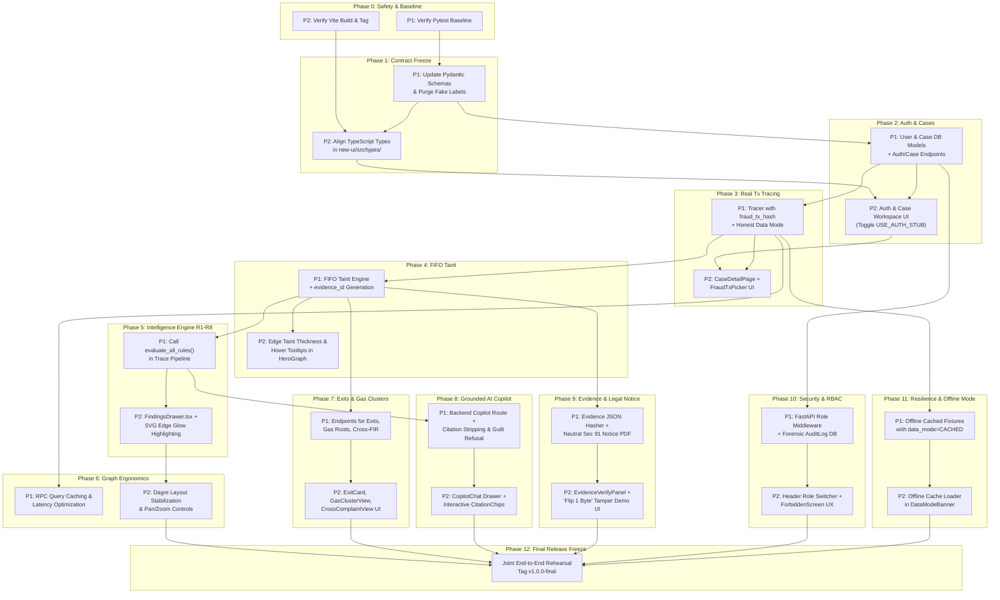

# TRACEX — PHASE DEPENDENCY GRAPH & CRITICAL PATH ANALYSIS
**Forensics Attribution & Graph Intelligence Engine**  
**Engineering Leads:** Person 1 (Apoorv) & Person 2 (Anvesh)

---

## 1. Visual Dependency Graph

---

## 2. Phase-by-Phase Dependency & Hand-off Matrix

| Phase | Phase Name | Person 1 Deliverable | Person 2 Deliverable | Dependency State | Hand-off Mechanism |
| :--- | :--- | :--- | :--- | :--- | :--- |
| **0** | Baseline & Safety | Pytest baseline passed | Vite build & tag verified | **PARALLEL** | Verified git branches pushed |
| **1** | Contract Freeze | Updated Pydantic schemas, purged 500 fake labels | Aligned TS types in `new-ui/src/types/` | **P2 BLOCKED BY P1** | Person 1 pushes `backend/api/` schemas |
| **2** | Auth & Cases | `User`/`Case` DB models, JWT routes | Case Workspace UI, auth flow | **P2 BLOCKED BY P1** | Person 2 flips `USE_AUTH_STUB = false` |
| **3** | Real Tx Tracing | Tracer with `fraud_tx_hash` entry point | `CaseDetailPage.tsx` + `FraudTxPicker.tsx` | **P2 BLOCKED BY P1** | Person 2 binds `api.startTrace` |
| **4** | FIFO Taint | `taint.py` FIFO engine + `evidence_id` | Edge thickness & hover tooltip | **P2 BLOCKED BY P1** | Graph edge payload contains `taint_amount` |
| **5** | Intelligence R1–R8 | Calls `evaluate_all_rules()` in pipeline | Findings Drawer + SVG Gold Edge Glow | **P1 BLOCKED BY P2** | Person 1 imports Person 2's `engine.py` |
| **6** | Graph Ergonomics | LRU caching for RPC queries | Smooth pan/zoom & Dagre layout | **PARALLEL** | Graph JSON schema |
| **7** | Exits & Clusters | `/exits`, `/gas-clusters`, `/cross-complaints` | Exit cards, Gas clusters, Cross-FIR UI | **P2 BLOCKED BY P1** | Live REST endpoints |
| **8** | Grounded Copilot | Backend `/copilot/chat` with citation checks | Copilot chat drawer with CitationChips | **P2 BLOCKED BY P1** | Live copilot streaming/REST endpoint |
| **9** | Evidence & Legal | JSON bundle hasher & neutral PDF notice | Bitwise verify panel & "Flip 1 Byte" UI | **P2 BLOCKED BY P1** | Bundle export format |
| **10** | Security & RBAC | Server-side role checks & `AuditLog` table | Header role switcher & forbidden screen | **P2 BLOCKED BY P1** | 403 Forbidden HTTP responses |
| **11** | Resilience | Cached fixtures with `data_mode=CACHED` | Cache loader button in DataModeBanner | **PARALLEL** | Pre-generated `demo_dossier.json` |
| **12** | Final Demo Freeze | Backend test pass & freeze | Frontend build & test pass | **JOINT FREEZE** | Final PR merge & tag `v1.0.0-final` |

---

## 3. Critical Path Analysis

The critical path is the longest sequence of dependent activities that directly determines the earliest possible completion time for the hackathon demo.

### The 5 Core Critical Path Steps:
1. **Phase 1 (Contract Freeze):** Person 1 updates `TraceRequest` and edge fields. Person 2 cannot wire real data until this contract is frozen.
2. **Phase 3 (Tx Tracing Engine):** Person 1 implements tracing from `fraud_tx_hash`. Without this, no real blockchain trace can be visualized.
3. **Phase 4 (FIFO Taint Engine):** Person 1 attaches `taint_amount` and `evidence_id`. This is the forensic backbone of the entire product.
4. **Phase 5 (Intelligence Engine Hookup):** Person 1 connects Person 2's R1–R8 engine into the trace loop.
5. **Phase 9 (Evidence Bundle & Verification):** Person 1 hashes the evidence payload; Person 2 executes the "Flip 1 Byte" tamper demonstration.

**Any delay in Person 1 completing Phase 1, 3, or 4 directly delays Person 2's ability to demonstrate live data.**

---

## 4. Parallelization Opportunities (No Blocking)

While Person 1 is building backend infrastructure, Person 2 is **NOT** idle. Because Person 2 built robust stubs (`USE_AUTH_STUB`, `USE_CASES_STUB`, etc.) during T1–T12:

1. **During Person 1's Phase 2 & 3:**
   - Person 2 can refine graph styling, edge animations (`#highlightGlow`), and layout physics in `HeroGraph.tsx` using cached fixtures.
2. **During Person 1's Phase 4 (FIFO Taint):**
   - Person 2 can build the UI components for Exits, Gas Clusters, and Cross-Complaints (`ExitCard.tsx`, `GasParentClusterView.tsx`, `CrossComplaintView.tsx`).
3. **During Person 1's Phase 7 & 8:**
   - Person 2 can perfect the Web Crypto API bitwise SHA-256 verification and the "Deliberately Corrupt 1 Byte" UI beat in `EvidenceVerifyPanel.tsx`.
4. **During Person 1's Phase 10 (Audit Log):**
   - Person 2 can prepare the offline demo fallback assets and polish the presentation script.
