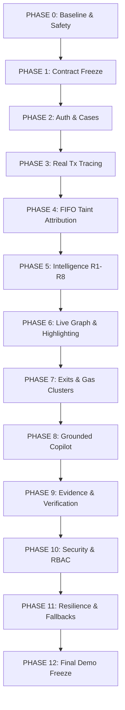

# TRACEX — SHARED PHASE PLAN & GITHUB EXECUTION ROADMAP
**TraceX Blockchain Forensics & Cryptocurrency Fraud Attribution Engine**  
**Hack The Future 3.0 / SIH Cyber Security Domain**  
**Lead Authors & System Owners:**  
- **Person 1 (Apoorv):** Blockchain Engine, Taint Attribution, Data Layer, Forensics Backend, Ingestion, OSINT  
- **Person 2 (Anvesh):** Unified Frontend (`new-ui`), Routing, Security UX, Intelligence Engine (R1–R8), Grounded Copilot, Verification  

---

## 1. Executive Summary & Source Priority

This document consolidates all planned and implemented engineering deliverables into a unified, dependency-aware roadmap.

### Source Priority
1. **Actual Repository Code:** Primary source of truth for what exists right now.
2. **Person 2 Execution Package (`TraceX_Person2_Antigravity_Execution_Package.md`):** Contract definitions, anti-hallucination policies, and acceptance criteria.
3. **Architecture Documentation (`.planning/codebase/`):** High-level component topologies and integration patterns.
4. **Project Documentation (`README.md`):** User setup and pre-seeded demo narratives.

---

## 2. Repository Forensic Audit (Current State)

### Person 1 Existing Work
- **Blockchain Ingestion & RPC (`backend/blockchain/rpc_client.py`):** Alchemy integration, live Blockscout fallback, and deterministic simulated transfer fallback.
- **Graph Traversal (`backend/blockchain/tracer.py`):** BFS exploration starting from `victim_wallet`, node classification, Neo4j persistence, and Cytoscape JSON output.
- **Database Layer (`backend/database/`):** SQLAlchemy models for `Complaint`, `Trace`, `WalletLabel`, `ClusteringResult`, and `FreezeNotice`.
- **API Router (`backend/api/routes.py`):** `/api/v1/trace`, `/api/v1/traces`, `/api/v1/graph/{trace_id}`, `/api/v1/cluster/{trace_id}`, `/api/v1/freeze-notice`, `/api/v1/labels`.
- **ML Models (`backend/ml/`):** Isolation Forest risk scoring (`risk_scorer.py`) and K-Means wallet clustering (`clustering.py`).
- **OSINT Crawler (`backend/scraper/exchange_crawler.py`):** Curated exchange labels and automated crawler.
- **Notice Generator (`backend/legal/notice_generator.py`):** ReportLab PDF compiler for Section 91 CrPC notices.

### Person 2 Existing Work
- **Consolidated Modern Frontend (`new-ui/`):** 100% migrated to Vite 6 + React 19 + Tailwind CSS, 0 lint errors, compiles in ~9s. Legacy `frontend/` retired.
- **Routing & Navigation (`new-ui/src/App.tsx`):** `react-router-dom` with 5 authenticated and guarded routes.
- **Security & RBAC UX (`useAuth.ts`, `RequireRole.tsx`, `ForbiddenScreen.tsx`):** Role-based testing for Investigator, Analyst, and Admin.
- **Case Workspace (`CaseDetailPage.tsx`, `FraudTxPicker.tsx`, `DataModeBanner.tsx`):** 66-character EVM transaction entry, dossier intake, and explicit data mode tagging (`LIVE` / `CACHED` / `UNAVAILABLE`).
- **Intelligence Engine R1–R8 (`backend/intelligence/`):** Pure deterministic mathematical rule engine for rapid passthrough (R1), peel chains (R2), fan-out (R3), fan-in (R4), privacy mixers (R5), gas sponsors (R6), and exchange off-ramps (R8). 31/31 unit tests pass.
- **Findings Drawer & Graph Highlighting (`FindingsDrawer.tsx`, `HeroGraph.tsx`):** Evidence-driven drawer with SVG gold glow edge highlighting (`#highlightGlow`).
- **Grounded AI Copilot (`backend/copilot/`, `CopilotChat.tsx`, `CitationChip.tsx`):** Adversarial citation validator (`[tx:...]`, `[edge:...]`, `[finding:...]`), sentence-level stripping of unverified claims, judicial guilt refusal, deterministic fallback, and interactive chat drawer.
- **Exits, Gas Clusters & Cross-Complaints UI (`ExitCard.tsx`, `GasParentClusterView.tsx`, `CrossComplaintView.tsx`):** Distinct Tier A/B/C badges, gas-parent grouping halos, and multi-FIR cross-case correlation.
- **Evidence Export & Tamper Verification (`EvidenceExportPanel.tsx`, `EvidenceVerifyPanel.tsx`, `NoticeDraftPreview.tsx`):** Role-gated bundle export, bitwise Web Crypto SHA-256 verification with "Deliberately Corrupt 1 Byte" demo beat, and neutral statutory notice preview.

### Identified Gaps & Discrepancies
1. **Contract Inconsistency on Trace Inception:** Backend traces start from `victim_wallet`, whereas forensic best practice and the execution package require starting from the specific `fraud_tx_hash`.
2. **Missing Edge Fields:** Backend `edges[]` lack `edge_id`, `taint_amount`, `taint_source_tx`, `evidence_id` (`sha256:...`), and `boundary_type` (`NONE | EXCHANGE | DEX | MIXER`).
3. **Missing Data Mode on Backend:** Backend responses do not emit `data_mode` (`LIVE | CACHED | SIMULATION | UNAVAILABLE`).
4. **Database Gaps:** `User` and `Case` tables do not exist in `backend/database/schemas.py`.
5. **Fabrication Purge Needed:** `backend/scraper/exchange_crawler.py` contains 500 fake hash-generated labels and USDT contract mislabeled as WazirX.
6. **Statutory Copy in Notice Generator:** `backend/legal/notice_generator.py` uses unauthorized Government of India / I4C letterhead and claims court-admissibility.

---

## 3. Priority Framework

- **P0 (Must Work for Final Demo):**
  - Fraud-tx trace initiation with live graph streaming
  - FIFO taint attribution on edges
  - R1–R8 Intelligence findings with graph edge highlighting
  - Grounded Copilot with clickable citations & guilt question refusal
  - Evidence bundle export + "Flip 1 Byte" tamper-evident verification
  - Neutral Section 91 notice preview
  - Honest Data Mode Banner (`LIVE` / `CACHED` / `SIMULATION` / `UNAVAILABLE`)
- **P1 (Important Production Features):**
  - Database-backed user login with JWT/cookie session
  - Cross-complaint dossier matching
  - Gas-parent cluster correlation
  - VASP Tier A/B/C classification
- **P2 (Nice to Have):**
  - Celery background queue processing
  - Neo4j multi-cluster persistence
- **CUT (Do NOT Spend Hackathon Time On):**
  - Multi-chain Solana / Bitcoin node RPCs (EVM is sufficient for demo)
  - Automatic letterhead generation implying government court powers
  - Retaining or reviving legacy Next.js `frontend/`

---

## 4. Sequential Development Phases



---

### PHASE 0 — Baseline & Repository Safety
**Goal:** Clean working baseline, branch alignment, and verified regression test suite.

- **Person 1 (Apoorv):**
  - Pull latest `main`.
  - Verify PostgreSQL/SQLite and Redis container configs in `docker-compose.yml`.
  - Confirm Python environment with `pytest backend/tests`.
- **Person 2 (Anvesh):**
  - Tag `pre-frontend-retirement` anchor.
  - Confirm `new-ui/` builds cleanly (`npm run lint` && `npm run build`).
  - Verify 31 intelligence and copilot unit tests pass.
- **Shared Contract:**
  - Standardize git origin to `https://github.com/anveshr312-bit/TraceX.git`.
  - Establish convention: never commit directly to `main`; all changes go through `phase/<name>` or `personX/<name>`.
- **Merge Order:** Person 1 pulls Person 2's consolidated repository structure.
- **Acceptance Criteria:** `npm run build` succeeds in `new-ui/`, `pytest` passes in `backend/`, and both developers can run the app locally.

---

### PHASE 1 — Contract Freeze (Case, Edge, Exit, Notice)
**Goal:** Complete, immutable TypeScript interfaces and Pydantic schemas agreed upon before implementation.

- **Person 1 (Apoorv):**
  - Update `backend/blockchain/models.py` with `HopRecord` fields:
    ```python
    edge_id: str
    from_address: str
    to_address: str
    value: str
    tx_hash: str
    asset: str
    chain: str
    timestamp: str
    hop_number: int
    taint_amount: str
    taint_source_tx: str
    evidence_id: str
    boundary_type: str  # NONE, EXCHANGE, DEX, MIXER
    ```
  - Add `data_mode: str` (`LIVE`, `CACHED`, `SIMULATION`, `UNAVAILABLE`) to `TraceResult`.
- **Person 2 (Anvesh):**
  - Mirror exact Pydantic fields in `new-ui/src/api/client.ts`.
  - Ensure all UI stubs (`casesStub.ts`, `intelligenceVizStub.ts`, `evidenceStub.ts`) reflect these types.
- **Shared Contract:** No developer may add or delete fields from `Edge`, `Case`, or `TraceResult` without mutual agreement.
- **Merge Order:** Person 1 commits Pydantic models; Person 2 updates frontend types.
- **Acceptance Criteria:** `pydantic` validation passes on test fixtures; frontend TypeScript compilation passes with zero type errors.

---

### PHASE 2 — Authentication & Case Dossier Foundation
**Goal:** Real persistent user sessions, role identification, and case management replacing frontend stubs.

- **Person 1 (Apoorv):**
  - Create `User` model in `backend/database/schemas.py` (`id`, `username`, `password_hash`, `role`).
  - Create `Case` model in `backend/database/schemas.py` (`id`, `complaint_ref`, `complaint_source`, `status`, `assigned_user_id`, `created_at`).
  - Implement endpoints in `backend/api/routes_auth.py`:
    - `POST /api/v1/auth/login` (sets httpOnly cookie or returns session token)
    - `POST /api/v1/auth/logout`
    - `GET /api/v1/auth/me`
  - Implement endpoints in `backend/api/routes_cases.py`:
    - `GET /api/v1/cases`
    - `GET /api/v1/cases/{case_id}`
    - `POST /api/v1/cases`
- **Person 2 (Anvesh):**
  - Flip `USE_AUTH_STUB = false` in `new-ui/src/api/client.ts`.
  - Flip `USE_CASES_STUB = false` in `new-ui/src/api/client.ts`.
  - Verify `LoginForm.tsx`, `CaseListPage.tsx`, and `CaseCreateForm.tsx` against real endpoints.
- **Integration:** Login with real investigator credentials -> redirects to `/` -> creates real case -> navigates to `/cases/:caseId`.
- **Acceptance Criteria:** No auth data stored in `localStorage`; 401 on unauthenticated access; case records persist across page refresh.

---

### PHASE 3 — Fraud-Tx First Blockchain Tracing
**Goal:** Initiating a trace directly from a 66-character EVM transaction hash and honest Data Mode emission.

- **Person 1 (Apoorv):**
  - Update `tracer.py` to accept `fraud_tx_hash: str`.
  - Look up transaction receipt on-chain to determine victim sender, attacker receiver, value, asset, and block number.
  - Return `data_mode = "LIVE"` if fetched from Alchemy/Blockscout, `"CACHED"` if from Redis/DB, or `"SIMULATION"` if fallback was triggered.
  - Expose `POST /api/v1/cases/{case_id}/trace` accepting `{ fraud_tx_hash, chain, max_hops }`.
- **Person 2 (Anvesh):**
  - Wire `FraudTxPicker.tsx` to `api.startCaseTrace(caseId, payload)`.
  - Connect `DataModeBanner.tsx` to the `data_mode` returned in the response.
- **Integration:** Entering a real transaction hash in the UI launches the backend BFS traversal; banner immediately reflects `LIVE` or `SIMULATION`.
- **Acceptance Criteria:** Invalid hashes rejected with 400; valid hashes initiate trace; UI data mode badge accurately matches backend source.

---

### PHASE 4 — FIFO Taint Attribution & Evidence IDs
**Goal:** Every transaction edge in the trace is attributed with FIFO taint and a cryptographic SHA-256 evidence identifier.

- **Person 1 (Apoorv):**
  - Implement First-In, First-Out (FIFO) taint tracking in `tracer.py`:
    - Initial fraud transaction has `taint_amount = tx_value`.
    - Downstream transfers consume available taint in chronological order.
  - Compute `evidence_id = sha256(f"{chain}:{tx_hash}:{from}:{to}:{value}:{timestamp}")`.
  - Tag `boundary_type = "EXCHANGE"` if recipient is VASP, `"MIXER"` if smart-contract pool, or `"NONE"`.
- **Person 2 (Anvesh):**
  - Update `HeroGraph.tsx` edge tooltip and side details to display `taint_amount` alongside total transfer amount.
  - Display `evidence_id` in transaction detail inspect drawer.
- **Integration:** Graph visualizes stolen fund proportions decaying across hops as funds split.
- **Acceptance Criteria:** Sum of outgoing taint never exceeds incoming taint for non-mint addresses; every edge has a valid `sha256:...` evidence string.

---

### PHASE 5 — Intelligence Engine (R1–R8) Pipeline Binding
**Goal:** Running the deterministic mathematical rule engine on real trace edges.

- **Person 1 (Apoorv):**
  - Call Person 2's `run_intelligence_pipeline(trace_edges, clusters, exits)` in `tracer.py` upon trace completion.
  - Store generated `Finding` models in PostgreSQL/SQLite `findings` table.
- **Person 2 (Anvesh):**
  - Verify `routes_intelligence.py` serves findings from DB via `GET /api/v1/intelligence/findings/{trace_id}`.
  - Ensure `FindingsDrawer.tsx` loads and displays R1–R8 findings for the completed trace.
- **Integration:** Completed trace immediately populates the Findings drawer with severity-sorted forensic detections.
- **Acceptance Criteria:** Passing the Euler benchmark edges fixture produces identical byte-deterministic findings in both standalone test and live backend execution.

---

### PHASE 6 — Real-Time WebSocket Streaming & Edge Highlighting
**Goal:** Live visual updates as nodes/hops are discovered, with interactive gold glow highlighting from findings.

- **Person 1 (Apoorv):**
  - Ensure `ws_manager.py` broadcasts `HOP_DISCOVERED` events containing full `hop_rec` with `evidence_id` and `taint_amount`.
  - Broadcast `TRACE_COMPLETED` with final risk score and summary findings.
- **Person 2 (Anvesh):**
  - Connect WebSocket listener in `CaseDetailPage.tsx` to append hops to `HeroGraph.tsx` dynamically.
  - Clicking any evidence badge in `FindingsDrawer.tsx` triggers `#highlightGlow` on the corresponding graph edge.
- **Integration:** Launching a trace shows edges appearing in real-time; clicking a finding lights up the exact fraud path in gold.
- **Acceptance Criteria:** Graph renders without jitter during live streaming; clicking finding correctly highlights target edges.

---

### PHASE 7 — Exits, Gas-Parents & Cross-Case Correlator
**Goal:** Real VASP off-ramp endpoints, gas funding clusters, and multi-complaint nexus detection.

- **Person 1 (Apoorv):**
  - **Purge Fabrication:** Delete the 500 hash-generated fake addresses in `exchange_crawler.py` and fix the USDT contract mislabel.
  - Implement `GET /api/v1/cases/{case_id}/exits` returning `[{exit_id, wallet, vasp_name, tier, evidence_ids, confidence}]`.
  - Implement `GET /api/v1/cases/{case_id}/gas-parent-clusters` returning `[{cluster_id, funding_wallet, funded_wallets, evidence_ids}]`.
  - Implement `GET /api/v1/cases/{case_id}/cross-complaint-matches` querying complaints sharing suspect addresses.
- **Person 2 (Anvesh):**
  - Flip `USE_INTELLIGENCE_VIZ_STUB = false` in `client.ts`.
  - Verify `ExitCard.tsx` renders distinct Tier A, B, and C badges.
  - Verify `GasParentClusterView.tsx` renders visual grouping halo and "Highlight in Graph" button.
  - Verify `CrossComplaintView.tsx` shows linked dossiers.
- **Integration:** All three views in the `clusters` tab consume real backend data without mock flags.
- **Acceptance Criteria:** Zero synthetic fake exchange labels appear in VASP matches; Tier A VASPs show nodal officer indicators; gas-parent highlight isolates syndicate in graph.

---

### PHASE 8 — Grounded Copilot Integration
**Goal:** Pure zero-hallucination forensic AI assistant answering investigator queries strictly from verified evidence.

- **Person 1 (Apoorv):**
  - Mount `routes_copilot.py` in `backend/main.py`.
  - Provide database read access for copilot forensic tools (`get_trace_summary`, `list_findings`, `get_edge`, `get_exit`).
- **Person 2 (Anvesh):**
  - Verify `CopilotChat.tsx` communicates with `POST /api/v1/cases/{case_id}/copilot/chat`.
  - Confirm inline citations (`[tx:...]`, `[edge:...]`, `[finding:...]`) render as clickable `<CitationChip>` components that highlight graph edges.
  - Confirm the judicial guilt question ("Is this wallet guilty?") renders the clean neutrality refusal without tripping errors.
  - Verify fallback tag `"answered from findings, not AI"` appears if unverified statements are stripped.
- **Integration:** Full end-to-end grounded assistant functioning within the case dossier workspace.
- **Acceptance Criteria:** Sub-10ms validator execution; 100% of factual statements cite real evidence; zero hallucinations survive.

---

### PHASE 9 — Evidence Bundle Export, Verification & Neutral Notice
**Goal:** Tamper-evident evidence export with real SHA-256 bitwise validation and neutral Section 91 notice generation.

- **Person 1 (Apoorv):**
  - **Neutral Notice Rework:** Update `backend/legal/notice_generator.py` to remove unauthorized Government of India / I4C letterhead and "court-admissible" claims; output neutral administrative draft.
  - Implement `POST /api/v1/cases/{case_id}/evidence/export` generating JSON/ZIP bundle with signed SHA-256 manifest.
  - Implement `POST /api/v1/cases/evidence/verify` computing bitwise checksums.
- **Person 2 (Anvesh):**
  - Flip `USE_EVIDENCE_STUB = false` in `client.ts`.
  - Verify `EvidenceExportPanel.tsx` downloads the signed evidence bundle.
  - Execute the **"Deliberately Corrupt 1 Byte"** demo beat in `EvidenceVerifyPanel.tsx` and confirm the explicit mismatch report (`filename`, `expected_sha256`, `actual_sha256`, `HASH_MISMATCH`).
  - Verify `NoticeDraftPreview.tsx` contains the Statutory Notice Neutrality disclaimer.
- **Integration:** Export bundle -> verify clean -> alter 1 byte -> verify flags exact corrupted file.
- **Acceptance Criteria:** Tampered bundle flags specific file and hash mismatch, never a generic failure; notice draft contains zero false authority claims.

---

### PHASE 10 — Security Hardening & RBAC Enforcement
**Goal:** Verifying that backend security boundaries reject unauthorized actions regardless of UI state.

- **Person 1 (Apoorv):**
  - Enforce role check on `POST /api/v1/cases/{case_id}/evidence/export`: return `403 Forbidden` if role is `ANALYST`.
  - Restrict case endpoints to assigned investigators or administrators.
- **Person 2 (Anvesh):**
  - Verify UI reflects role restrictions (Export button disabled for Analysts).
  - Verify that if an Analyst triggers an export directly via devtools, the Axios interceptor catches 403 and renders `ForbiddenScreen.tsx`.
  - Verify session expiry triggers redirect to `/login` without stale cached data.
- **Integration:** True defense-in-depth where UI convenience mirrors strict backend authorization.
- **Acceptance Criteria:** Analysts cannot export evidence; unauthorized case tampering returns 403; no API keys leaked in client bundle.

---

### PHASE 11 — Failure Resilience & Unavailable States
**Goal:** The application gracefully handles RPC node failures, database latency, and network disruptions without freezing.

- **Person 1 (Apoorv):**
  - Implement timeout guards on external RPC calls (Alchemy/Blockscout).
  - If RPC fails and simulation is disabled, return `data_mode: "UNAVAILABLE"` with 200 rather than crashing with 500.
- **Person 2 (Anvesh):**
  - Verify `UnavailableBanner.tsx` and `DataModeBanner.tsx` display when backend reports `UNAVAILABLE`.
  - Verify Copilot displays `"Copilot is unavailable. Deterministic findings below are unaffected."` when LLM is unreachable.
- **Integration:** Simulating network disconnect demonstrates truthful UI degradation rather than silent failure.
- **Acceptance Criteria:** UI never crashes or shows white screen on backend disruption; data mode banner truthfully informs the user.

---

### PHASE 12 — Final Demo Hardening & Code Freeze
**Goal:** Flawless reproducible walkthrough of the primary demonstration scenario.

- **Person 1 (Apoorv):**
  - Ensure pre-seeded Euler finance benchmark scenario is loaded and indexed in the database.
  - Final database migration and seed verification.
- **Person 2 (Anvesh):**
  - Verify complete end-to-end script:
    1. Log in as Investigator
    2. Create case from Euler fraud transaction hash
    3. Watch live trace and data mode banner
    4. Open Findings drawer; click R1/R5/R8 findings to highlight graph in gold
    5. Ask Copilot grounded query and guilt question
    6. View Exits, Gas Clusters, and Cross-Complaints
    7. Export evidence, corrupt 1 byte, verify mismatch report
    8. Preview neutral Section 91 notice
    9. Log out
- **Acceptance Criteria:** Entire walkthrough completes in under 5 minutes without console errors or manual workarounds.

---

## 5. Master Execution Matrix

| Phase | Person 1 (Apoorv) | Person 2 (Anvesh) | Dependency | Integration Verification | Demo Value |
|:---:|:---|:---|:---|:---|:---:|
| **0** | Baseline DB & RPC verification | Clean UI build & test suites | None | Both environments operational | Foundational |
| **1** | Pydantic edge/case models | TypeScript client interfaces | None | Schema consistency check | Foundational |
| **2** | `/auth/login`, `/me`, `/cases` | Wire `useAuth`, `CaseListPage` | P1 models | Login & case creation | P0 |
| **3** | Fraud-tx first trace endpoint | `FraudTxPicker`, `DataModeBanner` | P2 case shell | Trace launches from EVM hash | P0 |
| **4** | FIFO taint tracking & `evidence_id` | Edge taint & evidence tooltip | P3 trace run | Taint amounts on edges | P0 |
| **5** | Call `run_intelligence_pipeline` | Bind `FindingsDrawer` to DB | P4 edges | R1–R8 findings appear | P0 |
| **6** | WebSocket `HOP_DISCOVERED` | Live stream & SVG gold glow | P5 pipeline | Real-time graph edge lighting | P0 |
| **7** | Real `/exits`, `/gas-parents`, labels | Wire `ExitCard`, halos, matches | P4 trace data | Off-ramps & syndicate clusters | P0 |
| **8** | Mount `routes_copilot` in app | Wire `CopilotChat`, chips, refusal | P5 findings | Grounded AI & guilt refusal | P0 |
| **9** | Neutral notice, export/verify API | Export & "Flip 1 Byte" verify panel| P5 findings | Tamper-evident demo beat | P0 |
| **10** | Backend RBAC enforcement | Route guards & `ForbiddenScreen` | P2 auth | Role-gated security boundaries | P1 |
| **11** | Failure timeouts & error codes | `UnavailableBanner`, offline UI | Backend RPC | Truthful degradation on outage | P1 |
| **12** | Database seed & final rehearsal | Full walkthrough & code freeze | All phases | Flawless 5-minute judge demo | P0 |

---

## 6. Unexpected Extra Work Protocols ("Real-World Resilience")

If either developer discovers additional unplanned requirements:
1. **Never Break Phase Isolation:** Place the extra task inside the current phase under the header `REQUIRED EXTRA WORK`.
2. **Assign Ownership Immediately:** Designate whether Person 1 or Person 2 owns the implementation.
3. **Determine Block Status:** State explicitly whether the extra work blocks phase completion or can be deferred to Phase 11.
4. **Shared Infra Gate:** If the change touches `docker-compose.yml`, `schemas.py`, or `.env.example`, both developers must sync before committing.
