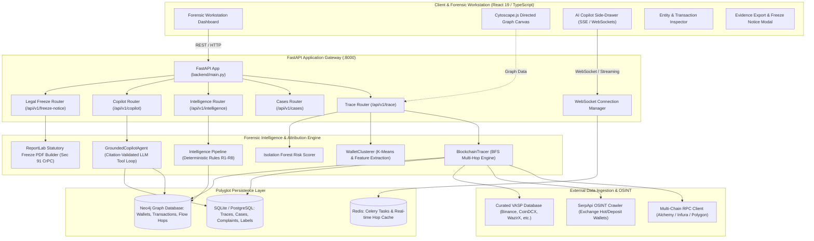
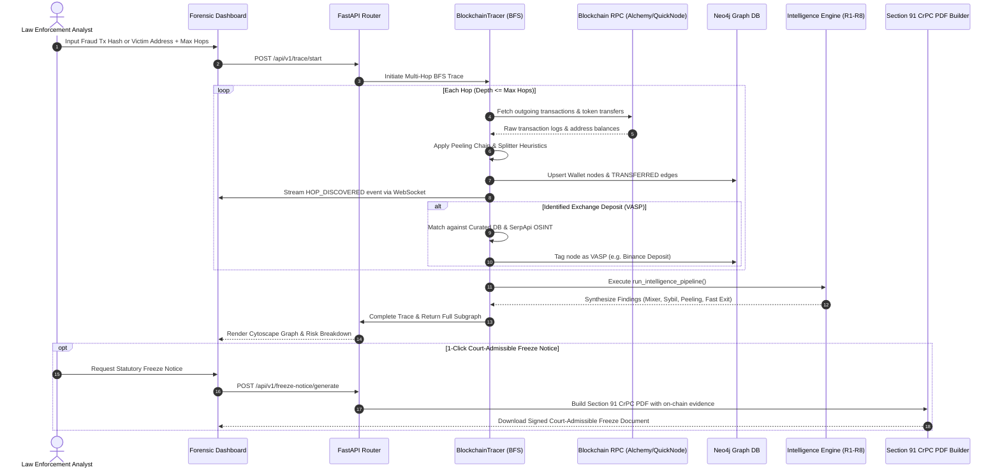
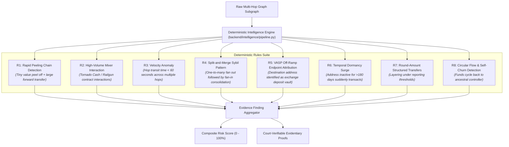
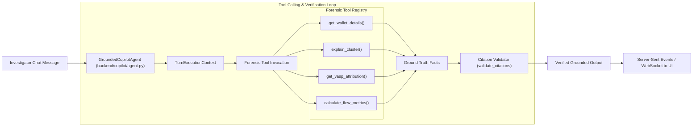

# TraceX Architecture Blueprint & Forensic Intelligence Engine

> Generated via **Graphify Knowledge Graph Extraction** (`879 nodes`, `2,063 edges`, `55 communities`) and architectural static analysis of the TraceX Autonomous Blockchain Forensics & Fraud Attribution Platform.

---

## 🧭 Visual & Interactive Navigation Hub

| Artifact | File Link | Description |
| :--- | :--- | :--- |
| **Interactive Knowledge Graph** | [graph.html](file:///c:/Users/anves/Downloads/Trace%20X%20dehradun/architecture/graph.html) | Full interactive 2D graph with zoom, community clustering, and search |
| **Call-Flow & Component Explorer** | [callflow.html](file:///c:/Users/anves/Downloads/Trace%20X%20dehradun/architecture/callflow.html) | Deep Mermaid call-flow sequences and subsystem call tables |
| **Collapsible Hierarchy Tree** | [tree.html](file:///c:/Users/anves/Downloads/Trace%20X%20dehradun/architecture/tree.html) | D3 collapsible code tree showing modules and dependency hierarchy |
| **Graphify Technical Report** | [GRAPH_REPORT.md](file:///c:/Users/anves/Downloads/Trace%20X%20dehradun/architecture/GRAPH_REPORT.md) | Community metrics, cohesion scores, god nodes, and audit logs |

---

## 1. High-Level System Architecture

TraceX integrates multi-chain RPC telemetry, an OSINT SerpApi crawler, an unsupervised machine learning anomaly scorer, deterministic forensic intelligence rules (R1–R8), a dual-store polyglot persistence layer (SQLite/PostgreSQL + Neo4j), and an interactive React 19 Cytoscape workstation.



---

## 2. Multi-Hop BFS Blockchain Forensic Tracing Engine

The tracing engine identifies laundering flows (peeling chains, transit splitters, mixer exit pools) by executing a bounded breadth-first search (BFS) across blockchain transactions.



---

## 3. Intelligence Pipeline & Deterministic Rules (R1–R8)

TraceX avoids LLM hallucination in criminal evidence by enforcing strict deterministic rules R1 through R8 before any narrative synthesis:



---

## 4. Grounded AI Copilot Architecture

The AI Copilot operates with deterministic tool validation and strict citation checking against the actual graph:



---

## 5. Architectural God Nodes (Extracted by Graphify)

The static analysis identified the following primary structural hubs across the repository:

| God Node | Edges | Module Location | Architectural Responsibility |
| :--- | :--- | :--- | :--- |
| `react` & `lucide-react` | 110 | `new-ui/src/*` | Frontend Workstation component rendering, iconography & reactive state |
| [`Trace`](file:///c:/Users/anves/Downloads/Trace%20X%20dehradun/backend/database/models.py) | 31 | `backend/database/models.py` | Canonical forensic trace entity connecting cases, hops, and freeze notices |
| [`BlockchainClient`](file:///c:/Users/anves/Downloads/Trace%20X%20dehradun/backend/blockchain/rpc_client.py) | 24 | `backend/blockchain/rpc_client.py` | Multi-chain RPC client abstraction with rate-limiting and block caching |
| [`BlockchainTracer`](file:///c:/Users/anves/Downloads/Trace%20X%20dehradun/backend/blockchain/tracer.py) | 22 | `backend/blockchain/tracer.py` | Core BFS traversal engine for transaction tracing and peeling detection |
| [`run_intelligence_pipeline`](file:///c:/Users/anves/Downloads/Trace%20X%20dehradun/backend/intelligence/pipeline.py) | 22 | `backend/intelligence/pipeline.py` | Evaluates deterministic forensic rules R1–R8 and outputs structured findings |
| [`Neo4jClient`](file:///c:/Users/anves/Downloads/Trace%20X%20dehradun/backend/neo4j/client.py) | 21 | `backend/neo4j/client.py` | High-throughput Cypher graph ingestion and multi-hop path query manager |
| [`validate_citations`](file:///c:/Users/anves/Downloads/Trace%20X%20dehradun/backend/copilot/citation.py) | 20 | `backend/copilot/citation.py` | Enforces evidentiary zero-hallucination verification for AI Copilot answers |
| [`ForensicCase`](file:///c:/Users/anves/Downloads/Trace%20X%20dehradun/backend/database/models.py) | 20 | `backend/database/models.py` | Root case management entity for law enforcement FIR/crime records |
| [`TurnExecutionContext`](file:///c:/Users/anves/Downloads/Trace%20X%20dehradun/backend/copilot/agent.py) | 17 | `backend/copilot/agent.py` | Manages stateful multi-turn forensic investigation context and tool receipts |

---

## 6. Directory & Module Structural Blueprint

```
Trace X dehradun/
├── architecture/                     <-- Architectural blueprints & Graphify exports
│   ├── ARCHITECTURE.md               <-- System blueprints & Mermaid diagrams (this document)
│   ├── index.html                    <-- Interactive Architecture Dashboard
│   ├── graph.html                    <-- Graphify 2D interactive force-directed graph
│   ├── callflow.html                 <-- Graphify Mermaid call-flow sequences
│   ├── tree.html                     <-- Graphify collapsible codebase tree
│   └── GRAPH_REPORT.md               <-- Graphify clustering and community cohesion report
├── backend/                          <-- FastAPI Backend & Forensic Services
│   ├── main.py                       <-- FastAPI App entrypoint, CORS & middleware
│   ├── api/                          <-- REST API route definitions
│   │   ├── routes.py                 <-- Core trace & health endpoints
│   │   ├── routes_cases.py           <-- Case management & FIR endpoints
│   │   ├── routes_copilot.py         <-- AI copilot chat & SSE streaming
│   │   └── routes_intelligence.py    <-- Rules R1-R8 execution & scoring
│   ├── blockchain/                   <-- Blockchain interaction layer
│   │   ├── tracer.py                 <-- BFS multi-hop traversal engine
│   │   ├── rpc_client.py             <-- Web3 / JSON-RPC node connector
│   │   └── heuristics.py             <-- Peeling chain & splitter heuristics
│   ├── copilot/                      <-- Grounded Forensic AI Assistant
│   │   ├── agent.py                  <-- GroundedCopilotAgent tool loop
│   │   └── citation.py               <-- Evidentiary citation validation
│   ├── database/                     <-- Relational Persistence (SQLite/PostgreSQL)
│   │   ├── db.py                     <-- SQLAlchemy session & engine lifecycle
│   │   ├── models.py                 <-- Case, Trace, WalletLabel, FreezeNotice ORM
│   │   ├── schemas.py                <-- Pydantic request/response DTOs
│   │   └── crud.py                   <-- Query access functions
│   ├── intelligence/                 <-- Forensic Intelligence Pipeline
│   │   ├── pipeline.py               <-- Deterministic Rules R1-R8 execution
│   │   └── rules/                    <-- Individual pattern detection rules
│   ├── legal/                        <-- Statutory Directives Engine
│   │   └── freeze_notice.py          <-- Section 91 CrPC PDF generator (ReportLab)
│   ├── ml/                           <-- Machine Learning Models
│   │   ├── clustering.py             <-- K-Means wallet behavioral clustering
│   │   └── isolation_forest.py       <-- Anomaly & risk scoring model
│   ├── neo4j/                        <-- Graph Database Driver
│   │   └── client.py                 <-- Cypher queries & bulk edge ingestion
│   ├── scraper/                      <-- OSINT Gathering
│   │   └── exchange_crawler.py       <-- SerpApi Google Search VASP crawler
│   └── tasks/                        <-- Background Workers (Celery / Redis)
├── new-ui/                           <-- Forensic Workstation Frontend (React 19 + Vite)
│   ├── src/
│   │   ├── App.tsx                   <-- Root router & application layout
│   │   ├── api/                      <-- Frontend API client & DTO definitions
│   │   ├── components/               <-- Reusable UI component modules
│   │   │   ├── cytoscape/            <-- Interactive canvas graph visualizer
│   │   │   ├── copilot/              <-- Chat assistant side drawer
│   │   │   ├── evidence/             <-- Evidence export & freeze notice modals
│   │   │   └── workstation/          <-- Workstation toolbars & inspector panels
│   │   └── pages/                    <-- Top-level application views
│   └── vite.config.ts                <-- Vite bundler configuration
├── docker/                           <-- Docker containerization & orchestration
│   └── docker-compose.yml            <-- Redis, Neo4j, Backend & Frontend multi-container
└── scripts/                          <-- CLI tooling, seeders & benchmarks
```
